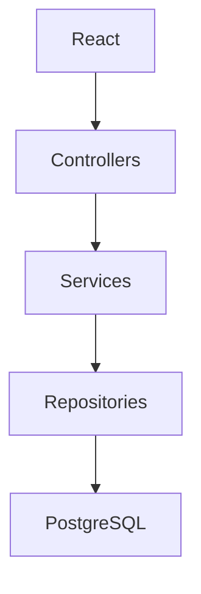

# Architecture Backend

```mermaid
flowchart TD

Client["React"]

Controller["Controllers"]

Service["Services"]

Repository["Repositories"]

Database["PostgreSQL"]

Client --> Controller
Controller --> Service
Service --> Repository
Repository --> Database
```